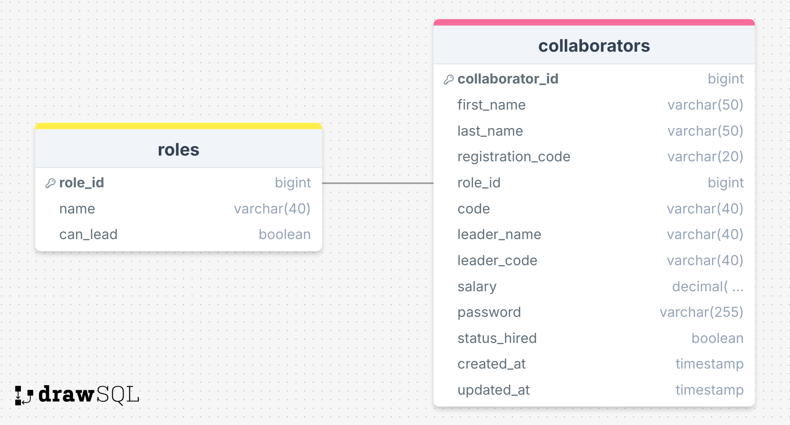

# API de Funcionários 

## Descrição

Este projeto é uma API desenvolvida utilizando **FastAPI** para gerenciar dados de funcionários. A API permite realizar operações como criar, consultar, atualizar e excluir funcionários, com foco em alta performance e escalabilidade.

## Estrutura do Banco de Dados 🗄️

Abaixo, a estrutura do banco de dados que foi utilizada no projeto, incluindo as tabelas `roles` e `employees`:



### Tabela: **roles**
- `role_id` (bigint)
- `name` (varchar(40))
- `can_lead` (boolean)

### Tabela: **employees**
- `employee_id` (bigint)
- `first_name` (varchar(50))
- `last_name` (varchar(50))
- `registration_code` (varchar(20))
- `role_id` (bigint)
- `code` (varchar(40))
- `leader_name` (varchar(40))
- `leader_code` (varchar(40))
- `salary` (decimal(...))
- `password` (varchar(255))
- `status_hired` (boolean)
- `created_at` (timestamp)
- `updated_at` (timestamp)

## Tecnologias e Bibliotecas Utilizadas 🛠️

As principais bibliotecas e tecnologias utilizadas para o desenvolvimento desta API são:

- **FastAPI**: Framework moderno e rápido para a construção de APIs RESTful.
- **Uvicorn**: Servidor ASGI rápido para rodar a aplicação.
- **SQLAlchemy**: ORM (Object-Relational Mapper) para interagir com o banco de dados de forma eficiente.
- **SQLAlchemy-Utils**: Ferramentas adicionais para trabalhar com SQLAlchemy.
- **Psycopg2**: Conector PostgreSQL para Python.
- **Alembic**: Ferramenta de migração de banco de dados para SQLAlchemy.
- **Dotenv**: Carrega variáveis de ambiente a partir de um arquivo `.env`.
- **Pytest**: Framework de testes para garantir a qualidade do código.
- **HTTPX**: Cliente HTTP assíncrono para realizar testes de API.
- **Bcrypt**: Biblioteca de hashing para senhas, garantindo segurança no armazenamento de dados sensíveis.

## Funcionalidades ⚙️

Esta API oferece os seguintes endpoints:

- **Criar Funcionário**: Cria um novo funcionário com informações como nome, código de registro, cargo, salário e senha.
- **Consultar Funcionário**: Permite buscar um funcionário pelo ID.
- **Atualizar Funcionário**: Atualiza informações de um funcionário, como salário, o líder e o cargo.
- **Excluir Funcionário**: Exclui um funcionário pelo ID.
- **Alterar Senha**: Atualiza a senha de um funcionário.
- **Alterar Status**: Modifica o status de contratação de um funcionário.

## Como Executar 🏃‍♂️

1. **Instalar Dependências**:

   Clone o repositório e instale as dependências:

   ```bash
   git clone <url-do-repositorio>
   cd <diretorio-do-repositorio>
   pip install -r requirements.tx